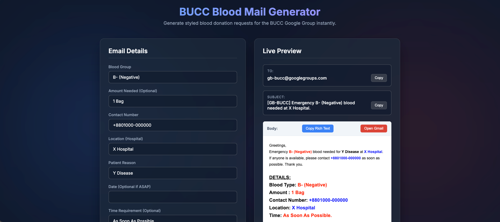
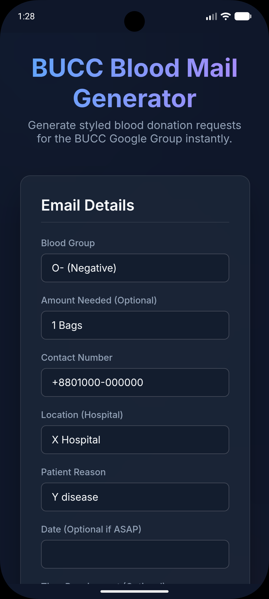
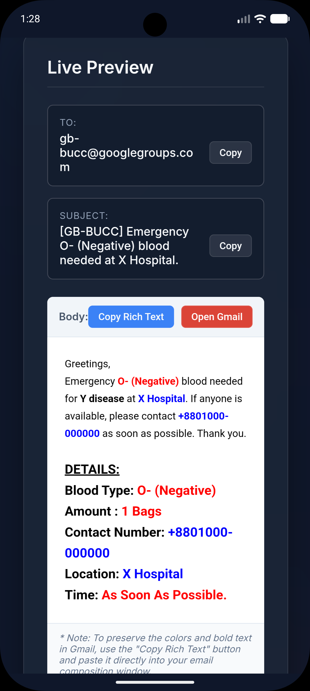

# BUCC Blood Mail Generator

A fast, client-side web application designed for the BUCC (BRAC University Computer Club) HR Department to easily generate formatted emergency blood donation request emails.

## Features
- **Live Preview:** Instantly see exactly what the email will look like as you type.
- **Rich Text Copy:** Securely copy the styled email body directly to your clipboard. This preserves all the critical red, blue, and bold text formatting so it pastes flawlessly into Gmail.
- **Dynamic Fields:** Automatically formats the Subject line and inserts the Blood Group, Location, Contact Number, Patient Reason, Date, and Amount into the email template.

## How to Use
1. Open the `index.html` file in any modern web browser (or visit the hosted GitHub Pages link).
2. Fill out the input fields on the left. (Note: Date, Amount, and Time are optional depending on the urgency).
3. Click **Copy Rich Text for Gmail** and paste it directly into your Gmail composition window.

## Reference Format
This generator was built to ensure all outgoing HR emails match the precise formatting of the following reference email:

## Screenshots

### Web UI

### Mobile Android App

  
  

